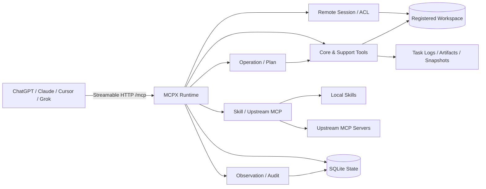

# MCPX

MCPX 是运行在本地开发环境中的 MCP Runtime（网关）。它通过
Streamable HTTP 把本地 Workspace、源码、变更、命令、任务、环境和扩展能力
安全地提供给 ChatGPT、Claude、Cursor、Grok 等 MCP 客户端。

MCPX 的重点不是增加一个聊天界面，而是提供一套可审计、可恢复、对模型友好
的开发工具协议：客户端可以跨连接恢复同一个 Remote Session，模型可以用文件 SHA、
Edit ID、Task ID 和能力版本避免重复读取和无效重试；Skill/MCP 的 revision 与 schema 一致性由 Runtime 内部管理。

## 能力概览

| 能力 | 说明 |
| --- | --- |
| Remote Session | 持久化 Workspace 会话、角色权限、事件、接力和跨客户端恢复 |
| Workspace | 注册多个项目，并在创建会话时显式绑定项目根目录 |
| Source | 文件窗口、批量读取、搜索、文件列表和有界上下文；返回 SHA-256 与编码/换行元数据 |
| Edit | 精确 replacement、批量变更、原子写、SHA 校验和格式保留 |
| Terminal | 执行命令或项目 Task；短命令内联返回，长命令持久化为 Task |
| Operation | 并行或有依赖地执行多个公开工具，并统一等待、分页、取消和恢复 |
| Project Task | 从项目配置中发现测试、构建和检查任务，并解析诊断信息 |
| Workspace State | 读取 Git 状态、快照、差异、监听结果和项目记忆 |
| Environment | 查看操作系统、架构、Shell、容器、资源、文件系统和工具链 |
| Extension | Session 建立时曝光 compact Skill / 普通 MCP / Plugin inventory；普通 MCP 走 `mcp_tool`，Plugin 走 `plugin_tool` 与原生 `plugin.*` 工具 |
| Artifact | 注册、列出和分页读取测试报告、构建产物、覆盖率和日志 |
| Screenshot | 截取显示器或屏幕区域，并通过 MCP ImageContent 返回 |
| Security | OAuth、Bearer、Remote Session ACL、命令/文件策略和语义确认 |
| Observation | 通过本机 Socket 观察工具调用、Task、Edit 和操作事件 |

## 架构



MCPX 把客户端连接、持久化 Remote Session、Workspace 能力、执行编排和扩展发现放在同一个
Runtime 边界内；所有有状态操作都绑定 `remote_session_id`，并通过 SQLite、Task 日志、Artifact
与 Observation 保留可恢复和可审计的执行状态。

## 公开工具

`tools/list` 是工具名称、描述、参数 Schema 和 Annotation 的唯一权威来源。
当前公开工具共 19 个，分为 12 个 core tools 和 7 个 support tools：

| 领域 | 工具 | 主要用途 |
| --- | --- | --- |
| Core | `workspace` | 零参数列出已注册 Workspace，供建立会话前选择 |
| Core | `session` | 创建、恢复或关闭 Remote Session；省略 action 默认 open/resume |
| Core | `read` | 读取、搜索、列举或组装 Workspace 源码上下文；环境事实使用 `environment_read` |
| Core | `edit` | 创建、更新或重命名 Workspace 文件；使用 SHA revision guard 和幂等语义，不提供删除 |
| Core | `move_out` | `prepare` 冻结明确的文件/目录/symlink manifest；用户确认后 `submit` 仅携带 `confirmation_uuid` |
| Core | `observe` | 查看 session、Execution Task、Plan Task、history 或 logs；Workspace 静态内容使用 `read` |
| Core | `progress` | 发布有业务意义的用户可见里程碑、等待、阻塞或失败状态 |
| Core | `execute` | 按策略执行命令或项目 Task，以及 attach、stop、stdin |
| Core | `plan` | create、read、advance、complete、block、replan、deliver 持久化计划 |
| Core | `artifact` | 产物登记、列表和分片读取 |
| Core | `skill_tool` | Skill 生命周期唯一入口：`list`、`describe`、`call`；Runtime 内部管理 revision |
| Core | `mcp_tool` | 普通 MCP Server/Tool 入口：`list`、`describe`、`call`；Runtime 内部管理 schema revision |
| Core | `plugin_tool` | Plugin 发现与 Inbox 入口：`list`、`describe`、`inbox`；实际能力直接调用 `plugin.<registration>.<tool>` |
| Support | `operation_batch` | 并发或按依赖 DAG 执行多个公开工具操作 |
| Support | `operation_manage` | 查询、等待、读取结果、取消和恢复异步 Operation |
| Support | `runtime_read` | 读取运行时能力、项目摘要或适用指令 |
| Support | `environment_read` | 读取当前主机/工具链环境或比较已保存快照 |
| Support | `environment` | 保存当前环境快照 |
| Support | `screenshot_capture` | 按明确 purpose 截取显示器或屏幕区域 |
| Support | `secret_provide` | 按明确 purpose 提供仅驻留内存的 Secret |

`workspace` 和 `session` 负责发现 Workspace 与建立/恢复会话；进入 Workspace 后，源码变更、命令、
Plan、Artifact 等有状态操作都以服务端返回的完整 `remote_session_id` 为关联主键。`runtime_read`、
`environment_read` 等读取型支持工具在参数足够时也可独立读取运行时或环境事实。

## 设计边界

MCPX 同时处理两类 Session：

| 标识 | 生命周期 | 用途 |
| --- | --- | --- |
| `Mcp-Session-Id` | Streamable HTTP 传输层临时标识 | 连接和协议状态，重连或换客户端后可能变化 |
| `remote_session_id` | SQLite 持久化业务标识 | Workspace、角色、Edit、Task、Plan、操作、快照和产物的主键 |

客户端应始终原样保存并复用服务端返回的 `remote_session_id`、`edit_id`、`plan_id`、
`plan_task_id`、`execution_task_id`、`operation_id` 和 `artifact_id`，不能自行缩写、猜测或从历史日志重建这些标识。
Skill/MCP 的 revision token 不再公开给模型；`describe` 与 `call` 之间的一致性由 Runtime 重新校验。
Plan Task 与执行 Task 是不同命名空间，不存在兼容的通用 `task_id` 字段。

MCPX 只提供 Streamable HTTP 的 `/mcp` 端点，不提供旧版 HTTP+SSE 的 `/sse`
或 `/message` 兼容端点。

## 部署教程

- [FRP + Caddy 原生部署：公网暴露 MCPX（非 Docker）](docs/frp-caddy-native.md)
- [FRP + Caddy + Docker Compose：公网暴露 MCPX（MCPX 保持原生运行）](docs/frp-caddy-docker-compose.md)

两篇教程都保持 MCPX 原生运行，保留对本地 Workspace、工具链、桌面和扩展能力的访问。原生版直接运行 Caddy/frps/frpc；Docker Compose 版只容器化 Caddy/frps/frpc。两篇文档均包含 OpenAI / ChatGPT Remote MCP 配置示例与截图。

## 快速开始

### 环境要求

- Go 1.26.1 或更高版本，具体版本以 `go.mod` 为准。
- 一个需要被 MCPX 管理的本地项目目录。
- 远程访问时需要 HTTPS 反向代理或其他受信任的网络入口。

### 从源码构建

```bash
git clone https://github.com/opentokenz/mcpx.git
cd mcpx
go build -o bin/mcpx ./cmd/mcpx-server
```

本地静态构建可以关闭 CGO：

```bash
CGO_ENABLED=0 go build -o bin/mcpx ./cmd/mcpx-server
```

普通 VCS 构建会从 Go build info 回填当前 Git revision（工作树有未提交变更时带 `-dirty`）；
正式发布仍以 GoReleaser 的 linker flags 为权威来源，同时注入版本、commit 和真实 build time。
CI 会构建带 provenance 的二进制并通过 `mcpx -version` 校验 commit/date 未丢失。

### 启动服务

前台运行：

```bash
./bin/mcpx
```

后台运行：

```bash
./bin/mcpx -d
```

后台模式会记录 daemon 状态到 `~/.mcpx/mcpx-daemon.json`，日志写入
`~/.mcpx/logs/mcpx-daemon.log`。再次启动前台服务或新的后台实例时，MCPX 会先停止
状态文件中仍存活的旧后台进程。

注册或更新一个 Workspace：

```bash
./bin/mcpx workspace register /path/to/your/project
./bin/mcpx workspace register --name my-app /path/to/your/project
```

Workspace registry 支持完整生命周期：

```bash
./bin/mcpx workspace list
./bin/mcpx workspace rename my-app app
./bin/mcpx workspace unregister app
./bin/mcpx workspace prune
./bin/mcpx workspace prune --apply
```

`workspace list` 会显示 `ok`、`missing` 或 `invalid` 路径状态；`prune` 默认只预览 stale registration，只有 `--apply` 才修改 registry。`unregister` 和 `prune --apply` 都不会删除、移动或修改 Workspace 文件。

Runtime 不缓存 Workspace registry：`workspace` 列表、按名称解析和新 Session 创建都会读取当前全局 `config.yaml`，因此 CLI 或手工更新 registry 后无需重启 MCPX。已经创建的 Remote Session 保存自己的 Workspace path；之后 rename/unregister registry 不会让既有 Session 丢失该 path，但新 Session 必须使用当前存在且状态为 `ok` 的 registration。

然后启动服务：

```bash
./bin/mcpx
```

默认监听地址和 MCP 端点：

```text
http://127.0.0.1:9090/mcp
```

首次启动会在 `~/.mcpx/`（可用 `MCPX_HOME` 覆盖）初始化运行时目录：

| 路径 | 用途 |
| --- | --- |
| `config.yaml` | 全局监听、鉴权、安全策略和 Workspace 配置 |
| `.mcp.json` | 全局上游 MCP Server 配置 |
| `logs/` | JSONL 审计和运行日志 |
| `skills/` | 可选的本地 Skill 根目录 |
| `workspaces.example.yaml` | Workspace 配置示例 |
| `state/mcpx.db` | Remote Session、Edit、Task、Plan、操作、快照和产物索引 |
| `tasks/` | 持久终端 Task 的日志文件 |

查看版本和命令帮助：

```bash
./bin/mcpx -version
./bin/mcpx -h
```

主要命令包括：

```text
mcpx [flags]                     启动 Streamable HTTP 服务
mcpx observe [flags] <name>      终端只读观测 Workspace 事件
mcpx workspace <command>          管理 Workspace registry（list/register/rename/unregister/prune）
mcpx oauth-register [url]        动态注册 OAuth 客户端
mcpx update [flags]              从 GitHub Release 检查并安装新版本
```

服务进程常用 flags 包括 `-addr`、`-log-level`、`-log-format`、`-d` 和 `-version`。
自更新支持：

```bash
./bin/mcpx update --check
./bin/mcpx update
./bin/mcpx update --version 0.9.6
```

`update` 会选择当前平台对应的 GitHub Release 产物，校验 `checksums.txt` 中的 SHA-256，
再验证下载后的二进制版本并替换当前可执行文件；访问 GitHub API 需要认证时可使用
`GITHUB_TOKEN`。

## 配置

### 全局配置

全局配置路径为 `~/.mcpx/config.yaml`，可用 `MCPX_HOME` 改变根目录。
下面是一个偏保守的常用配置示例；相比首次生成的默认配置，它把未知命令的默认决策收紧为 `confirm`：

```yaml
server:
  host: 127.0.0.1
  port: 9090

auth:
  # open | bearer | oauth | dual
  # 留空时：配置 token 则等同 bearer，否则等同 open。
  mode: open
  token: ""
  oauth:
    password: ""
    server_url: ""
    token_ttl: 86400

workspaces:
  - name: my-app
    path: /Users/you/code/my-app
    description: "业务项目"

security:
  commands:
    # allow | confirm | deny
    default: confirm
    allow:
      - ^pwd$
      - ^ls\b
      - ^git status
      - ^git diff
    confirm:
      - ^git push
      - ^docker
      - ^npm install
    deny:
      - ^rm -rf /
  files:
    max_read_bytes: 1048576
    max_patch_files: 20
    max_patch_lines: 2000
    deny:
      - ^\.git/

limits:
  max_result_bytes: 262144
```

首次生成配置的主要默认值包括：监听 `127.0.0.1:9090`；Streamable HTTP transport
空闲 Session TTL 为 `24h`；窗口读取安全预算为 1 MiB，显式 `full` 源文件硬上限为 4 MiB；
文件策略默认 `max_patch_files=20`、`max_patch_lines=2000`，而公开 `edit` 工具还有独立的
1000 changed-lines 硬上限；工具结果预算为 256 KiB；Terminal、File Watch、Skill 和上游 MCP
发现默认启用。状态保留任务默认每天运行一次，过程事件与终端 Task 默认保留 30 天，模型记忆事件
保留 180 天，环境快照保留 90 天。

需要特别注意：当前首次生成的 `config.yaml` 使用 `security.commands.default: allow`，同时内置
`git push` / `docker` / `npm install` 的 `confirm` 规则和 `rm -rf /` / `mkfs` / `shutdown` 的
`deny` 规则；`auto_allow_readonly` 未显式配置时也会自动允许受支持的只读命令。策略匹配顺序是
`deny` → `confirm` → `allow` → 只读自动放行 → `default`。共享环境或公网部署建议像上面的示例一样
把默认决策收紧为 `confirm` 或 `deny`。公网部署同时不要使用 `auth.mode: open`，应使用 `oauth`、
`bearer` 或 `dual`，并配置最小权限规则。

### 项目配置

项目根目录可以放置 `.mcpx.yaml`，用于覆盖项目描述、项目级安全规则、能力
开关和结果限制。进程级身份凭证不应写在项目配置中。

```yaml
description: "项目说明"

security:
  commands:
    default: confirm
```

### Instruction Context

MCPX 只使用一个全局自然语言入口：`~/.mcpx/system_prompt.md`。Global 不扫描 `AGENTS.md`，也不再提供 `global_agents_path` 配置。Workspace 级指令统一使用项目根和目录树中的 `AGENTS.md`。

对于某个 Workspace/path，MCPX 按以下顺序解析同一种 instruction context：

```text
~/.mcpx/system_prompt.md          global
trusted MCP initialize.instructions  extension
<workspace>/AGENTS.md             project
<workspace>/**/AGENTS.md          directory
```

Global `system_prompt.md` 与 Workspace `AGENTS.md` 在 Runtime 内具有相同的 instruction 语义，只是发现范围和优先级不同。单个 `system_prompt.md` / `AGENTS.md` 最大 64 KiB；默认内联 instruction context 总预算为 256 KiB。文件 SHA 用于读取一致性、revision 和调试，不代表 trust，也不会因为自然语言内容变化要求用户重新批准。

Instruction context 是 live 的，不冻结到 Remote Session。`session(action="open")` 默认返回 descriptor；需要读取具体内容、按目录解析或刷新当前上下文时使用 `runtime_read(view="instructions")`，也可以提供 `id`、`anchor_path` 或 `paths`。例如 `id="global"`、`id="project"`、`id="dir:backend"`。

### 上游 MCP

MCPX 只接受两个 MCP 配置入口：

```text
Global:    ~/.mcpx/.mcp.json
Workspace: <workspace>/.mcpx/.mcp.json
```

同名的 Workspace registration 会**整体替换**同名 Global 普通 MCP，不做字段级 merge，也不会继承 Global trust。Workspace 不能声明 Plugin 身份，也不能覆盖同名 Global Plugin。

MCP 与 Global Plugin 都支持 `enabled`；省略时默认为 `true`。`enabled: false` 会保留 registration 供 inventory/debug 查看，但不会启动或调用对应 MCP；Global Plugin 被禁用时也不会挂载 `plugin.*` 工具。Plugin catalog 仍是启动时的 process-wide snapshot，因此修改 Global Plugin 的 `enabled` 后需要重启 Runtime 才会改变 mounted tool catalog。

```json
{
  "mcpServers": {
    "github": {
      "type": "stdio",
      "command": "npx",
      "args": ["-y", "@modelcontextprotocol/server-github"],
      "enabled": true
    },
    "workflow": {
      "type": "stdio",
      "command": "workflow-mcp",
      "trust": true,
      "injectInstructions": true
    }
  }
}
```

Global registration 中的 `trust: true` 直接生效。Workspace 中的 `trust: true` 只表示**请求持久 trust**：首次实际调用时 MCPX 要求用户确认，批准记录保存到 `~/.mcpx/mcp-trust.json`。批准绑定 Workspace path、registration name 与一个内部 registration fingerprint；普通用户无需维护这个 SHA。

当前 fingerprint 覆盖 `type`、`command`、`args`、`injectInstructions` 以及 Plugin contract（Workspace 目前不能声明 Plugin）。修改这些字段会让旧批准失效并在下次调用时重新确认；`enabled`、`trust`、`description` 和 `env` 当前不参与 fingerprint，其中 ENV 暂不作为这轮信任校验对象。

`injectInstructions: true` 表示允许读取 MCP `initialize` 握手返回的 `instructions`，但只有 effective trust 为 true 时才会进入 instruction context。也就是说 Workspace 可以同时声明 `trust: true` 与 `injectInstructions: true`，但批准 trust 之前不会自动注入。自然语言 instructions 内容本身不做 fingerprint 或独立 Prompt approval。

#### Plugin V1

Plugin V1 仍只能由管理员在 Global `~/.mcpx/.mcp.json` 中声明。MCPX 启动时读取其 `tools/list`，验证显式 Tools 与 Inbox，并把公开能力挂载为 `plugin.<registration>.<upstream-tool>`。Workspace 可以定义普通 MCP、请求 trust 和 instruction injection，但不能声明 `isPlugin` / `plugin`，也不能用同名普通 MCP 替换 Global Plugin。

```json
{
  "mcpServers": {
    "comet": {
      "type": "stdio",
      "command": "comet-mcp",
      "isPlugin": true,
      "trust": true,
      "plugin": {
        "tools": ["context", "action", "doctor"],
        "inbox": "inbox"
      }
    }
  }
}
```

`plugin.tools` 必须显式列出公开工具，不支持 wildcard；`plugin.inbox` 必须指向真实上游 Tool，并保持为私有 awareness endpoint，不能同时出现在公开工具列表。Plugin 不出现在普通 `mcp_tool` inventory；使用 `plugin_tool(action="list|describe|inbox")` 发现 Plugin、查看 mounted schema 或聚合 Inbox，实际调用直接使用 `plugin.comet.context` 一类原生工具。

Plugin catalog 是 MCPX 启动时的 process-wide snapshot。调用 mounted tool 时 Runtime 会再次核对当前上游 Tool schema；如果启动后 schema 发生变化，返回 `PLUGIN_TOOL_SCHEMA_CHANGED`，需要重启 MCPX 重建 catalog。`trust: true` 只跳过 MCPX 的通用上游确认，不会绕过 schema 校验、上游权限或上游自身的安全机制。

### Skill 发现

默认扫描 `~/.mcpx/skills`、`~/.agents/skills`、`~/.codex/skills`、
`~/.grok/skills` 和项目 `.skills`。可以在全局配置中使用
`discovery.skills.dirs` 和 `extra_dirs` 增加或替换目录。

### 状态保留

`state.retention` 负责定期回收过期的观测、Task 日志、快照和临时记录。
活跃会话、未完成 Plan、未过期确认、有效幂等记录和仍被引用的快照
会受到保护。保留策略只在全局 `config.yaml` 中生效。

## 接入 MCP 客户端

### 本地 Bearer 客户端

```json
{
  "mcpServers": {
    "mcpx": {
      "url": "http://127.0.0.1:9090/mcp",
      "headers": {
        "Authorization": "Bearer YOUR_TOKEN"
      }
    }
  }
}
```

将 `auth.mode` 设置为 `bearer`，并在 `auth.token` 中配置 Token。仅本机临时
调试可以使用 `open`。

### 网页端 Remote MCP

网页端通常使用 OAuth。先通过反向代理暴露 HTTPS，再配置：

```yaml
server:
  disable_localhost_protection: true
  trust_proxy_headers: true

auth:
  mode: oauth
  oauth:
    password: "换成强口令"
    server_url: "https://mcp.example.com"
```

然后将 `https://mcp.example.com/mcp` 添加到客户端（ChatGPT / Codex Remote MCP）。

OAuth 对齐 [OpenAI MCP 鉴权约定](https://developers.openai.com/plugins/build/auth) 与
MCP Authorization（OAuth 2.1 + PKCE）：

- 资源元数据：`/.well-known/oauth-protected-resource`（及 `/mcp` 路径形态）
- 授权服务器元数据：`/.well-known/oauth-authorization-server`（含
  `client_id_metadata_document_supported: true`，优先 CIMD）
- DCR：`POST /mcp/oauth/register`（CIMD 不可用时仍可用）
- 授权 / 换票：`/mcp/oauth/authorize`、`/mcp/oauth/token`（`resource` 参数 + S256）

ChatGPT 使用 **CIMD**（`client_id` 为 `https://chatgpt.com/oauth/...` 文档 URL）时，
服务端会拉取并校验元数据，并接受
`https://chatgpt.com/connector/oauth/{callback_id}` 与旧回调
`https://chatgpt.com/connector_platform_oauth_redirect`。
仍可用手动 DCR 预注册：

```bash
./bin/mcpx oauth-register 'https://chatgpt.com/connector/oauth/...'
# 或交互输入回调地址：
./bin/mcpx oauth-register
```

OAuth 发现与授权端点包括：

```text
GET  /.well-known/oauth-protected-resource
GET  /.well-known/oauth-authorization-server
POST /mcp/oauth/register
GET|POST /mcp/oauth/authorize
POST /mcp/oauth/token
```

产品不内置公网隧道服务。反向代理负责 HTTPS、域名和网络暴露，MCPX 负责
MCP 协议、鉴权和 Workspace 访问控制。

### 握手探测

不要用裸 `GET /mcp` 判断服务是否可用，使用 MCP `initialize` 请求：

```bash
curl -sS -m 5 \
  -H 'Content-Type: application/json' \
  -H 'Accept: application/json, text/event-stream' \
  -d '{"jsonrpc":"2.0","id":1,"method":"initialize","params":{"protocolVersion":"2025-11-25","capabilities":{},"clientInfo":{"name":"curl","version":"0.1"}}}' \
  http://127.0.0.1:9090/mcp
```

响应中出现 `mcpx` Server 信息表示协议握手成功。

## 推荐交互流程

### 1. 建立会话和能力缓存

1. Workspace 名称未知时先调用零参数 `workspace`，从返回清单中选择项目。
2. 使用 `session(action="open", workspace="...")` 创建 Remote Session；省略 `action` 也默认 open。
3. 保存服务端返回的完整 `remote_session_id`。恢复已有会话时再次调用
   `session(action="open", remote_session_id="...")`，不要改写、缩写或重建这个 ID。
4. `session` bootstrap 已返回工具能力、compact Skill/MCP inventory、适用 instruction descriptor、项目摘要和一组 Runtime revision；默认不内联完整 instruction 内容，也不返回完整 Skill instructions 或 MCP Tool schema。需要当前 instruction 内容/目录解析时调用 `runtime_read(view="instructions", ...)`；需要单独刷新能力时调用 `runtime_read(view="capabilities")`；需要扩展详情时按需调用 `skill_tool` / `mcp_tool` 的 `describe`。
5. 客户端可以缓存 `tool_schema_revision`、`capability_manifest_revision`、`guidance_revision`、
   `instruction_revision`、`session_capability_revision` 和 `client_protocol_revision`，再与后续 bootstrap /
   `runtime_read` 返回值比较，按变化范围刷新本地缓存。Skill revision 与 MCP Tool schema revision 由 Runtime
   在 `describe → call` 间维护和复核，不作为公开缓存字段。当前公开 Schema 不接受 `known_revisions` 参数。

ARC 2.0 将工具 effect 与 Agent 语义轨迹分开：`purpose` 只描述本次工具操作的作用，
`plan_id`、`plan_task_id`、`execution_task_id`、`operation_id` 用于绑定执行上下文。Client Protocol Activity V3 直接嵌入会话内 MCP 工具参数：可选 `activity` 对象允许同一次调用同时提供 `intent`、`hypothesis`、`evidence`、`conclusion`、`next`、`status`，但只应填写本次发生实质变化的字段，不重复未变化内容。`intent` 是整个工作 turn 的目标并开启新 turn；`hypothesis` 是待验证且可被推翻的暂定判断；`evidence` 只写刚获得的可核验事实；`conclusion` 写由 evidence 支持的当前判断；`next` 表示立即要执行且与当前 tool call 对齐的动作；`status` 只用于无法归入前五类的阶段、等待或阻塞变化。Runtime 按固定顺序展开非空字段，并自动生成 `turn_id`、`sequence`、`state=preparing_action`、`related_call_id`。旧 `/mcp/activity` HTTP ingress 已移除。服务端只把已经接受并持久化的真实 Activity snapshot 放入 `structuredContent.context.activity` 和 `_meta["mcpx.result"].mcpx.result.context.activity`；ARC 不直接复制 raw tool input，也不会从工具结果反推、伪造 Activity。`reasoning_summary`、`progress_summary`、`next_step` 不再属于 ARC context。
`move_out(action="submit")` 的业务参数只有 `action`、`remote_session_id`、`confirmation_uuid`；公共可选 `activity` 只记录公开工作轨迹，不改变 prepare 时由服务端冻结的业务语义。
`progress` 不作为每个普通工具调用的 heartbeat；过程只在有业务意义的里程碑、等待、阻塞或失败时发布。任务正常完成并准备给用户最终回复前，必须调用一次 `progress(status="completed")`，用 `current` 汇总完成状态、`result` 列出已验证结果。

终端观测使用普通 stdout/stderr pipe，不依赖 PTY、tmux 或 ConPTY。观测事件先写入
durable Store，再通过本地 JSONL 帧推送；`observe --format=json`、终端 text 渲染和
其他 JSONL 客户端消费同一事件。事件的 `phase` 表示 `action_started`、`output`、
`result` 或 `error`，语义上下文字段会在 JSONL、历史和 text observer 中保留。`call_id` 缺省回退为
`request_id` 用于内部请求关联；不同客户端接力时使用同一个 `remote_session_id`，并可结合
`workspace` 调用 `observe(view="history")` 查询历史操作。`plan_task_id`、`execution_task_id`、`operation_id` 负责各自的计划、执行和操作归属。

### 2. 读取源码

```json
{
  "remote_session_id": "rs_...",
  "view": "file",
  "path": "src/main.ts",
  "mode": "window"
}
```

`read(view="file")` 返回：

- `sha256`：后续 edit 的 `base_sha256`，始终针对原始文件字节。
- `format.charset`：字符集，例如 `utf-8`。
- `format.bom`：BOM 状态。
- `format.line_ending` 和 `line_ending_counts`：`LF`、`CRLF`、`CR` 或 `mixed`。
- `format.final_newline`：文件是否以换行符结尾。
- `truncated`、`offset`、`limit` 和 `next_action`：窗口读取状态。

生成变更时必须保留这些格式元数据。带 UTF-16 BOM 的文件会先以 Unicode 文本呈现，
写回时恢复原字符集和 BOM。完整预览使用单个 `path` 和
`mode="full"`；完整模式返回 `mime_type`、完整 SHA-256 和原始格式。源码扩展名
优先按文本处理，例如 TypeScript 返回 `text/typescript`，不会因系统 MIME 表
把 `.ts` 误判为 `video/mp2t`。图片使用 MCP `ImageContent`，二进制文件使用
Base64 数据。

已知多个文件时，使用同一次 `read(view="file", items=[...])` 批量读取，
并通过 `max_total_bytes` 控制总预算。搜索、列表和上下文读取分别使用
`view="search"`、`view="list"` 和 `view="context"`，不要为了确认一个已知路径
先重复列目录。

`read(view="list")` 同时返回两类结果：`files` 是递归普通文件分页；`entries` 是当前
scope 的第一层条目，并以 `kind=file|directory|symlink|other` 标记类型，不会展开目录内容。
清理“只保留某文件”的 Workspace 前，先读取根 scope 的 `entries`：只有
`entries_complete=true` 且 `entries_policy_filtered=false` 时才能把它当作完整可见根清单。
若存在 `entries_next_cursor`，按 `entries_next_action` 读取其余第一层条目；不要从
`files` 的首个分页推断顶层目录。

### 3. 修改文件

默认修改路径如下：

```text
read(view="file") → edit → observe(view="changes")
```

`edit` 接收 `edits[]`，支持 create、update、rename；用户提出删除、移除或清理时必须使用专用的
`move_out(action="prepare") → 用户确认 → move_out(action="submit")` 流程，目标会安全移至操作系统回收站而非永久删除，update 优先使用
精确唯一 `replacements`。同一请求带 `idempotency_key` 时，重试返回原终态，
参数变化返回 `IDEMPOTENCY_CONFLICT`。默认只返回有界 diff 预览；需要完整内容时
使用 `observe(view="diff", edit_id, offset, limit)` 分片读取。

生产限制和破坏性操作契约：完整 `read` 的源文件上限为 4 MiB，超大文件使用
`mode="window"` 流式读取；单次 `read.items` 最多 20 项；`operation_batch` 最多
32 步；`edit` 最多 1000 条真实变更行。`read(view="list", path=...)` 的 `path`
是硬作用域。

`edit` 只支持 create、update、rename；删除、移除或清理必须使用同一个 `move_out` 工具的两阶段 action，
禁止通过 `execute`、shell、glob 或 symlink 绕过：

1. `move_out(action="prepare")` 接收 Workspace 内明确的 `file`、`directory` 或 `symlink` 目标。它严格只读，
   只校验目录根路径，不扫描、哈希或返回目录子项；file 冻结 SHA，symlink 冻结链接文本摘要。响应只返回
   最多 20 个显式目标预览、总目标数和 manifest SHA，因此数万文件目录不会撑大模型上下文。
   `purpose` 必须先表达最终语义：仅检查就写“仅 prepare/仅预览”并停止；用户请求删除、移除或清理时
   则从 prepare 开始明确写“安全移至系统回收站”，不能在 submit 时临时改写语义。
2. 服务端返回 `confirmation_uuid`、`move_request_id`、`manifest_sha256`、原始
   `idempotency_key` 与 `expires_at` 供展示和审计；默认确认有效期为 30 分钟。同时返回
   `next_action.tool="move_out"`，其 arguments 只含 `action="submit"`、`remote_session_id` 和 `confirmation_uuid`。
3. 网页端模型向用户展示冻结清单并询问；用户确认后，模型原样执行服务端返回的 `next_action`。
   `move_out(action="submit")` 的 strict schema 不接受 `purpose`、`workspace`、`targets`、`idempotency_key`、
   `manifest_sha256` 或其他 prepare 参数。
4. `move_out(action="submit")` 按 UUID 从服务端取回并重新校验 Workspace 范围、manifest、文件 SHA、过期时间和
   purpose；客户端无法覆盖这些冻结值。明确的 `directory` 是整体移出根，不扫描其后代；`symlink`
   （包括目录确认后被替换的 symlink）只移动链接入口，绝不跟随目标。通过校验后目标进入当前操作系统的
   回收站：Windows 使用 Recycle Bin，macOS 使用 Finder Trash（必要时回退到用户 `~/.Trash`），Linux
   优先使用 `gio trash`，其次 `trash-put`，均不可用时按 FreeDesktop Trash 规范写入
   `$XDG_DATA_HOME/Trash/{files,info}`（未设置时使用 `~/.local/share/Trash`）。返回字段仍使用
   `quarantine_path` / `quarantine_location` 表示实际回收站位置或 URI；提交同时写入持久化审计。

安全移出能力支持明确指定的非空目录树和 symlink；目录内的 symlink、特殊文件不会阻断移动，也不会在
prepare 时被逐项核验或回传，但
absolute path、`..` 越界和中间 symlink 仍拒绝。`move_out` 在 MCP `tools/list` 中采用保守的顶层声明：
`readOnlyHint=false`、`destructiveHint=true`、`idempotentHint=true`、`openWorldHint=false`；同时通过
`mcpx/action_risk` 标明 `prepare` 为 read-only/non-destructive、`submit` 为 destructive。提交前仍执行注册 Workspace、显式目标、revision guard、
目录不递归展开、symlink 不跟随、用户确认与持久化审计等安全约束；最终文件系统动作由平台回收站机制完成。

示例：

```json
{
  "remote_session_id": "rs_...",
  "purpose": "根据用户要求修改首页标题",
  "idempotency_key": "req-update-home-title-1",
  "edits": [
    {
      "operation": "update",
      "path": "src/App.vue",
      "base_sha256": "sha256:...",
      "replacements": [
        {"match": "<h1>旧标题</h1>", "replacement": "<h1>新标题</h1>"}
      ]
    }
  ]
}
```

普通变更保持原文件字符集、BOM、换行和末尾换行状态。版本冲突、匹配失败和策略
错误都会返回结构化 `error.code`、`retryable`、`recovery` 或 `next_action`。

### 4. 执行命令和 Task

```json
{
  "remote_session_id": "rs_...",
  "action": "run",
  "command": "go test ./internal/server -count=1",
  "purpose": "验证本次服务端变更",
  "scope": "workspace",
  "yield_time_ms": 10000
}
```

`execute` 支持用 `&&`、`||` 和 `;` 组合简单命令。服务端会在启动 shell **之前**解析全部 segment，逐段应用
`deny` / `confirm` / `allow` 策略并记录结构化 `command_policy`；任一 segment 为 `deny` 时整条命令拒绝，
任一 segment 为 `confirm` 时对整条冻结命令进行一次用户确认。只有全部 segment 通过，并且启用的
preflight audit 成功写入后，原始 command 才会一次性交给 shell。管道、重定向、单个 `&`、换行、`$()`
和反引号命令替换仍然拒绝。

这里的“全部执行或拒绝”是**策略与审计入口的原子 gate**，不是文件系统事务或副作用回滚。shell 启动后仍保留
原始条件语义：`a && b` 只在 `a` 成功后执行 `b`，`a || b` 只在 `a` 失败后执行 `b`；已经执行的 segment
产生的副作用不会因后续 segment 失败而自动回滚。

`execute(action="run")` 默认等待短命令完成；超过等待窗口时返回 `execution_task_id`。后续
使用已知 ID：

```text
observe(view="task", execution_task_id="task_...")
observe(view="logs", execution_task_id="task_...", stdout_offset=0, stderr_offset=0)
execute(action="attach", execution_task_id="task_...", yield_time_ms=30000)
```

长命令的状态和日志使用 observe 的 offset/next offset 续读；输出被截断时响应会
直接给出下一次调用模板。`stop` 和 `stdin` 通过 `execute(action="stop|stdin")`
完成，并重新执行权限与 Workspace 校验。

`execution_mode="async"` 只表示把本次工具调用提交为异步 Operation，不保证立即返回
`execution_task_id`。命令是否脱离为持久化执行 Task 由 `yield_time_ms` 决定：命令在等待窗口内结束时，
Operation 结果直接包含 `completed_in_call=true`；需要 Task 生命周期时，应设置小于预期
运行时长的 `yield_time_ms`，再使用返回的 `execution_task_id` 调用 `observe` 或 `execute(action="attach")`。

### 5. Plan、Artifact 与扩展

`plan(action="create|read|advance|complete|block|replan|deliver")` 只引用服务端
返回的 `plan_id`、`plan_task_id` 和结构化 evidence；`create.tasks[].local_id` 仅在创建请求内解析依赖。典型路径是：

```text
plan(create) → plan(advance) → edit/execute → artifact(register) → plan(complete) → plan(deliver)
```

产物使用 `artifact(action="register|list|read")`；注册时持久化 `source_encoding`/`source_bom`，读取时
`source_offset`/`next_source_offset` 始终使用源文件 byte 坐标。UTF-8/UTF-16 文本通过
`delivery_encoding=utf-8` 返回 `text`，二进制通过 `delivery_encoding=base64` 返回 `base64`，不会把任意字节伪装成文本。

`session(action="open")` 默认返回 compact `extension_inventory`，并返回当前 instruction context 的 descriptor：Skill 只包含 relevance routing 所需信息，普通 MCP 默认只到 Server 级，Plugin 单独列出；完整 instruction 内容通过 `runtime_read(view="instructions", id=...)` 按需读取，或由 `include_instructions_content=true` 显式内联。典型路径：

```text
session(open)
  → skill_tool(action="list|describe|call", ...)
  → mcp_tool(action="list|describe|call", ...)
  → plugin_tool(action="list|describe|inbox", ...)
  → plugin.<registration>.<tool>(...)
```

Skill：不知道有哪些能力时 `list`；知道名称但缺少使用规则时 `describe`；信息充分时直接 `call`。
普通 MCP：不知道 Server 时 `list`；知道 Server 但不知道 Tools 时 `list(server=...)`；缺少 Tool schema 时 `describe`；参数充分时 `call`。
Plugin：`plugin_tool` 只负责 inventory、schema 与 Inbox awareness；公开能力已经挂在 MCPX 自身 `tools/list`，直接调用对应的 `plugin.*` 工具。
模型不再提交 `discovery_id` / `discovery_revision`；Runtime 在 `call` 前重新检查当前 Skill revision 或 MCP Tool schema，发生变化时返回结构化 recovery，要求重新 `describe`。

`skill_tool` 与 `mcp_tool` 的顶层 MCP annotation 按最坏情况声明为可破坏、开放世界调用；Runtime 再根据本次选中的对象做实际决策。文档型 Skill，以及上游明确标注为只读且 closed-world 的 Tool 可直接调用；可执行 Skill、缺少风险 annotation 的上游 Tool，以及任何可写、可破坏或开放世界调用都会先返回 `waiting_confirmation`。用户确认后，使用相同业务参数并设置 `user_confirmed=true` 重试；服务端只接受与当前目标、revision、参数摘要和用途匹配的 pending confirmation。恢复动作不会回显 extension arguments，避免把可能的 Secret 写入错误响应或日志。

MCP 的 `call` 在同一个已初始化的上游实例内完成 `tools/list`、schema 校验和 `tools/call`，不会先检查实例 A、再执行实例 B。Session inventory 与 `mcp_tool(action=list)` 只返回 Server 名称、description 和状态，用于第一轮 relevance routing；完整 Tool schema 仍需按需 `describe`。

### 6. 批量和异步操作

需要并行读取或执行多个相互独立的工具时使用 `operation_batch`；有依赖时在
`depends_on` 中声明步骤 ID。使用 `operation_manage`：

```text
operation_manage(action="wait", operation_id="op_...")
operation_manage(action="result", operation_id="op_...")
```

不要通过重复 `status` 轮询等待同一个操作；运行中的操作会返回一次性的
`next_action`，通常应直接执行一次 `wait`。`operation_manage` 的批量模式只接受
`operation_ids`，且仅支持 `status` 和 `result`，不能把它再次嵌套进
`operation_batch`。

当异步操作内部执行 `execute` 时，MCPX 会等待其终端 Task 进入最终状态后
再记录 `operation.completed`。`wait` 直接在 `steps[].result` 返回已展开的机器结果，
不会再额外复制一份顶层 aggregate/raw MCP envelope；需要聚合结果或分页字节时显式调用
`operation_manage(action="result")`。客户端不需要解析嵌套的 `content[].text`。

### 7. 统一响应

工具默认文本适合模型和宿主直接展示；机器结果同时保存在
`structuredContent` 和 ARC 元数据 `_meta["mcpx.result"]`。响应状态包括：

`tools/list` 同时为 MCPX 工具公布 `outputSchema`，其描述的是实际返回的
`structuredContent` 公共结构（`status`、`type`、`context`、`data`、`error`、`hints`、`actions`），
并对有硬上限的工具通过 `x-mcpx-limits` 发布与 `runtime_read(view="capabilities").limits` 同源的限制。
`runtime_read(view="capabilities")` 的 `runtime` 同时给出 `version`、`build_commit`、`build_time`、
`tool_schema_revision` 和 capability 版本信息；旧的顶层 revision alias 不再返回。正式 release/CI
构建由 linker flags 注入真实 `build_commit` 与 `build_time`；普通 VCS 构建至少回填 revision/dirty 状态。

| 状态 | 含义 |
| --- | --- |
| `succeeded` | 操作已成功完成 |
| `accepted` | 已交给持久化 Operation 或 Task，需按 ID 继续 |
| `waiting_confirmation` | 需要先向用户展示摘要并获得明确确认 |
| `interrupted` | 执行被中断，但可根据返回 ID 查询状态 |
| `failed` | 业务、策略、版本或运行时失败，应按结构化错误恢复 |

大结果不会在多个字段中重复镜像。Task 日志和 Artifact 可通过以下 Resource URI
读取；Edit Diff 使用 `observe(view="diff")` 分页：

```text
mcpx://remote-sessions/{remote_session_id}/tasks/{execution_task_id}/logs
mcpx://remote-sessions/{remote_session_id}/artifacts/{artifact_id}
```

ARC 2.0 的 `structuredContent.context` 保持精简，只携带当前结果真正存在的语义与关联字段：

```json
{
  "context": {
    "purpose": "验证命令执行结果",
    "activity": {
      "turn_id": "turn_...",
      "sequence": 3,
      "state": "preparing_action",
      "kind": "evidence",
      "summary": "相关测试已通过",
      "related_call_id": "call_..."
    },
    "plan_id": "pl_...",
    "plan_task_id": "pt_...",
    "execution_task_id": "task_...",
    "operation_id": "op_..."
  }
}
```

其中 `activity` 来自 Runtime 已接受并持久化的 Client Protocol Activity snapshot；字段不存在时不会
为了填满结构而伪造。旧的 `reasoning_summary`、`progress_summary`、`next_step` 不属于公开 ARC context，
语义轨迹统一通过 `activity` 表达。`progress` 负责用户可见的阶段与终态：过程按需发布里程碑、等待、阻塞或失败；正常任务在最终回复前固定发布一次 `completed`，并在 `result` 中列出已验证结果。新的 `session` bootstrap 还会返回最新的 model progress state（若存在）。

终端文本按可用信息展示 `purpose`、最新 Activity 以及 Plan / Plan Task / Execution Task / Operation
关联信息；`-detail` 再追加 call、path 等执行元数据。

## 本机终端观测

服务运行期间，可以在另一个终端只读观察指定 Workspace：

```bash
./bin/mcpx observe my-app
```

命令使用本机 Socket 订阅服务端事件，不启动第二个 HTTP 服务，不执行工具、命令
或文件修改。启动时回放历史事件，随后实时接收事件；断线后按 sequence 补偿。

可用参数：

```text
-history int       回放最近事件数量，范围 1-100，默认 100
-format text|json  文本或一行一个 JSON 事件，默认 text
-detail            显示语义用途、操作 ID 和执行事实
-diff summary|preview|full  默认 full
-tool string       按工具过滤
-status string     按事件状态过滤
-operation string  按 operation_id 过滤
-path string       按文件路径过滤
```

示例：

```bash
./bin/mcpx observe -format json -history 100 my-app
./bin/mcpx observe -detail -diff full -tool edit my-app
```

默认 `text` 模式是持续追加的行式文本流，直接写入 stdout，在终端、管道或重定向场景均可使用；
`json` 模式每行输出一个完整 JSON 事件，适合脚本与日志采集。

文本流布局保持固定的缩进层级：

- 事件行：状态标记（`•` / `!` / `?`）+ 语义动作（`Read`、`Edited`、`Ran`、`Searched`）+ 目标标签；
- 事实与结果：2 空格缩进的子行，展示耗时、退出码、结果摘要与失败原因；
- 命令输出：4 空格缩进、行首带行号，并按 stdout / stderr 区分着色。
- Activity 使用单行紧凑格式 `◇ Kind 内容`，不显示事件时间或额外分隔符；连续 Activity 不插空行。工具调用的 `purpose` 使用同样的 `◇ Purpose 内容` 单行格式，并在对应工具块之前只显示一次。所有工具交互之间统一只保留一个空行，不输出独立分隔线或墙钟时间；超过终端宽度自动软换行。

颜色层级（ui-ux-pro-max 语义色规范）：

- 状态标记使用状态色（失败红 / 等待确认黄 / 运行中蓝 / 成功回退工具色）；
- 动作动词使用工具语义色（`Read` 青、`Edited` 绿、`Ran` 琥珀、`Plan` 黄、`Session` 品红）；
- 目标标签与结果值保持默认前景色，事实 key（`time`、`path`、`exit_code` 等）使用 muted 次级色；
- 命令输出行号使用 muted 色，stdout 弱化（dim）、stderr 黄色；
- 支持真彩色终端时全部语义色升级为 true-color 变体，普通终端降级 ANSI 16 色，`NO_COLOR=1` 或非终端完全无色。

ARC 内容仍先显示 `Read`、`Edited`、`Ran`、`Searched` 等语义动作，再按实际存在的字段显示 Context（`purpose`、最新 Activity、Plan / Task / Operation 关联信息）、执行事实和结果；命令 stdout/stderr 带行号。内部 `operation.*` 调度事件、重复的远端 `*.started`/`*.completed` notice 默认静默，只保留失败、取消等对人有用的最终结果。ARC 人类展示层继续按工具和状态使用稳定 ANSI 颜色，Diff 默认完整（`-diff full`），区分新增、删除和上下文；支持真彩色终端时使用真彩色，普通终端降级 ANSI 16 色。设置 `NO_COLOR=1` 可关闭颜色，`COLORTERM=truecolor` 或 `24bit` 启用真彩色；非终端（管道/重定向）自动关闭颜色。

`-detail` 会追加 operation、call、path 等执行元数据；默认视图只展示必要事实，避免与事件行重复。机器处理、重定向或管道场景也可直接使用默认 `text` 模式，或选择 `--format json` 获取无格式的完整事件。
事件中保留 `event_id`、`sequence`、`request_id`、`operation_id`、`plan_task_id`、
`execution_task_id`、`edit_id`、状态、耗时、路径、命令和截断标志等字段。

## 安全与数据边界

- `open` 只适合本机临时调试；公网必须使用 `bearer`、`oauth` 或 `dual`。
- 反向代理场景按需启用 `disable_localhost_protection` 和
  `trust_proxy_headers`，并限制可信 `allowed_origins`。
- Remote Session 使用 `viewer`、`editor`、`approver` 和 `owner` 角色。
- 命令和文件都经过策略匹配；命令可允许、要求确认或拒绝，文件变更还会检查
  SHA-256、路径和差异预算。
- `execute`、Skill/MCP 等需要确认的调用可通过 `user_confirmed` 表达用户对同一冻结业务请求的确认，
  服务端仍会重新执行权限与策略检查；`move_out` 使用独立的 `prepare → confirmation_uuid → submit`
  协议，`submit` 只接受服务端签发的确认 UUID 和 `remote_session_id`。
- `secret_provide` 的明文值只在进程内短期使用，不写入 SQLite、Workspace 或日志。
- SQLite、Task 日志、OAuth 客户端注册和 Token 密钥位于 `~/.mcpx/`，运行时使用
  受限文件权限；不要把真实 Token、密码或 Secret 写入仓库和命令字符串。
- 截图默认通过 MCP 返回，不写入 Workspace 或 SQLite。
- `state.retention` 会清理过期过程事件、Task、快照和临时记录，但保护活跃会话
  和未完成交付状态。

## 项目开发

仓库结构：

```text
cmd/mcpx-server       服务入口、后台模式、observe、workspace、oauth-register 和 update
internal/server       HTTP Gateway、20 个公开工具、Resource、capability 与协议适配
internal/arc          ARC 2.0 结果契约、structuredContent、呈现与 trace metadata
internal/remotesession Remote Session、角色、handoff 与持久化事件
internal/edit         Edit 解析、原子写、格式保留和变更摘要
internal/deletion     move_out 请求、确认凭据和安全移出状态
internal/operation    异步 Operation、依赖调度和结果分页
internal/terminal     Execution Task 生命周期、日志、端口和诊断
internal/source       搜索、列表、上下文和批量读取
internal/environment  主机/工具链环境检查、快照与比较
internal/observation  事件存储、本机观测、Activity 和终端渲染
internal/auth         Bearer、OAuth、Principal 和 ACL
internal/config       全局/项目配置及 MCP/Skill 发现
internal/update       GitHub Release 自更新、checksum 和二进制替换
docs/plans            实现计划
docs/specs            设计规格
```

提交前运行：

```bash
gofmt -w ./cmd ./internal
test -z "$(gofmt -l ./cmd ./internal)"
go test ./... -count=1
go test -race ./... -count=1
go vet ./...
CGO_ENABLED=0 go build -o bin/mcpx ./cmd/mcpx-server
git diff --check
```

更多分支、Pull Request 和发布要求见 [CONTRIBUTING.md](CONTRIBUTING.md)。

## 许可与使用边界

本项目使用 [Apache License 2.0](LICENSE)。MCPX 面向学习、研究和获得授权的
开发环境自动化。使用者需要自行确认 Workspace、命令、凭证、网络入口和数据的
授权范围；在生产环境使用前应完成安全评估、备份、最小权限配置和人工确认流程
验证。本文档不构成安全、法律、医疗、财务或其他专业建议。

## Star History

<a href="https://www.star-history.com/?repos=opentokenz%2Fmcpx&type=date&legend=top-left">
 <picture>
   <source media="(prefers-color-scheme: dark)" srcset="https://api.star-history.com/chart?repos=opentokenz/mcpx&type=date&theme=dark&legend=top-left&sealed_token=jUtxc1OYmFK08WQj99XkmFzM0HRA-hpQB7I9wHBLMBGHx-67q1wA2YAs4xsVkz5atYfU4hBNzBeZ1PgKY6SZM1t4MY6U70cFpKG49h7I-p1HEzbjWiJMh5EIJ2wl7Mc4ihBZ05TXuvpgxIR_0SppHmEn18A66kOXgnljlPGZm18kCP52p6jPzPM1hH_v" />
   <source media="(prefers-color-scheme: light)" srcset="https://api.star-history.com/chart?repos=opentokenz/mcpx&type=date&legend=top-left&sealed_token=jUtxc1OYmFK08WQj99XkmFzM0HRA-hpQB7I9wHBLMBGHx-67q1wA2YAs4xsVkz5atYfU4hBNzBeZ1PgKY6SZM1t4MY6U70cFpKG49h7I-p1HEzbjWiJMh5EIJ2wl7Mc4ihBZ05TXuvpgxIR_0SppHmEn18A66kOXgnljlPGZm18kCP52p6jPzPM1hH_v" />
   
 </picture>
</a>

## 致谢

感谢 [LINUX DO](https://linux.do) 社区：**学 AI，上 LINUX DO。**

---

## 故障排查

- 启动后检查日志中的 `endpoint`、鉴权模式和 inventory（Workspace / Skill / MCP）。
- 客户端连不上时，先确认 URL 是 `/mcp`、客户端支持 Streamable HTTP、端口一致且 Token 有效。
- `401`：检查 `Authorization`、OAuth issuer、resource URL 和 `server_url`。
- `/sse` 或 `/mcp/sse` 返回 `404`：这是预期行为；请把客户端改为 Streamable HTTP `/mcp`。
- 客户端看不到新工具：刷新 MCP Server，必要时新建客户端会话以重新获取工具表。
- 截图失败：检查桌面会话、录屏权限和 Linux 截图后端。
